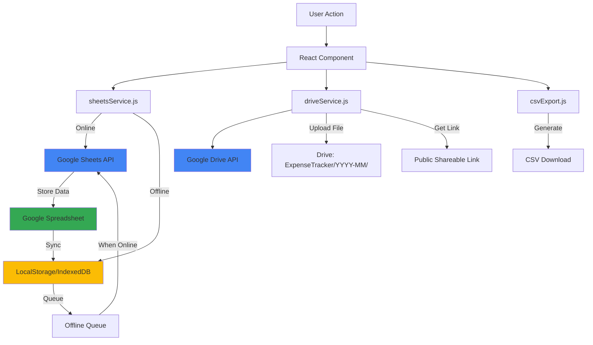

# Monthly Expense PW

A with Google Drive Integration

## Architecture Overview

The app will be a React-based PWA with:

- **Frontend**: React with Tailwind CSS
- **PWA**: Workbox for service worker and offline capabilities
- **Cloud Storage**: Google Sheets API for primary data storage (syncs across devices)
- **Local Cache**: localStorage/IndexedDB for offline support and performance
- **File Storage**: Google Drive API for attachments (screenshots/invoices)
- **Authentication**: Google OAuth 2.0 for Drive and Sheets access
- **Export**: CSV generation with Drive public links

## Data Structure

### Google Sheets Structure

The app will use a single Google Spreadsheet with multiple sheets:

1. **Months Sheet**: `[monthKey, initialBalance, reimbursements (JSON), carryForward]`
2. **DailyExpenses Sheet**: `[id, monthKey, date, description, amount, attachmentUrl, driveFileId]`
3. **WeeklyPayments Sheet**: `[id, monthKey, weekEndDate, amount, description]`
4. **Settings Sheet**: `[key, value]` (stores Drive folder ID, spreadsheet ID, etc.)

### Local Cache Schema (for offline support)

- **localStorage**: `{ spreadsheetId: string, lastSync: timestamp, offlineQueue: [] }`
- **IndexedDB**: Cached data for offline access, synced with Sheets when online

## Data Flow




## Key Components

### 1. Authentication & Setup

- **GoogleAuth.jsx**: OAuth flow component for Google Drive and Sheets access
- **driveService.js**: Service for Drive API operations (upload, create folder, get public link)
- **sheetsService.js**: Service for Google Sheets API operations (read, write, create spreadsheet)
- Handles token storage and refresh
- On first use: Creates spreadsheet and stores ID in localStorage

### 2. Monthly Balance Management

- **MonthlyBalance.jsx**: Form to enter initial balance and reimbursements at month start
- Saves to Google Sheets (Months sheet) with month key (YYYY-MM format)
- Caches locally for offline access

### 3. Daily Expense Entry

- **DailyExpense.jsx**: Form with date picker, description, amount, and file upload
- Uploads file to Google Drive (monthly folder)
- Gets public shareable link
- Saves expense with Drive link to Google Sheets (DailyExpenses sheet)
- Queues for sync if offline

### 4. Weekly Payment Entry

- **WeeklyPayment.jsx**: Form to log vendor payments
- Saves to Google Sheets (WeeklyPayments sheet)
- Links to current month's records

### 5. Monthly Report

- **MonthlyReport.jsx**: Displays:
- Total expenses (daily + weekly)
- Initial balance + reimbursements
- Remaining balance
- Automatic carry-forward calculation
- Export to CSV button

### 6. CSV Export

- **csvExport.js**: Utility function to:
- Gather all transactions for the month
- Format as CSV with columns: Date, Description, Amount, Attachment URL
- Trigger browser download

### 7. PWA Configuration

- **service-worker.js**: Workbox configuration for offline support
- **manifest.json**: PWA manifest with icons and install prompts
- Cache static assets and API responses

## File Structure

```javascript
montlyExpenseReact/
├── public/
│   ├── manifest.json
│   ├── service-worker.js
│   └── icons/ (PWA icons)
├── src/
│   ├── components/
│   │   ├── GoogleAuth.jsx
│   │   ├── MonthlyBalance.jsx
│   │   ├── DailyExpense.jsx
│   │   ├── WeeklyPayment.jsx
│   │   ├── MonthlyReport.jsx
│   │   └── Navigation.jsx
│   ├── services/
│   │   ├── driveService.js (Google Drive API)
│   │   ├── sheetsService.js (Google Sheets API)
│   │   ├── syncService.js (Sync local cache with Sheets)
│   │   └── csvExport.js
│   ├── utils/
│   │   ├── dateUtils.js
│   │   └── storage.js
│   ├── App.jsx
│   ├── index.js
│   └── index.css (Tailwind)
├── package.json
└── vite.config.js (or create-react-app config)
```


## Implementation Details

### Google Drive Integration

1. **OAuth Setup**: Use Google Identity Services (GIS) for authentication
2. **Folder Creation**: Create folder structure: `ExpenseTracker/YYYY-MM/` in Drive
3. **File Upload**: Upload attachments to monthly folder, set permissions to "anyone with link"
4. **Link Storage**: Store Drive file ID and public link in Google Sheets

### Google Sheets Integration

1. **Spreadsheet Creation**: On first use, create a new spreadsheet or use existing one
2. **Sheet Structure**: Create/verify required sheets (Months, DailyExpenses, WeeklyPayments, Settings)
3. **Data Operations**: 

- Read all data on app load
- Write operations append/update rows
- Batch operations for efficiency

4. **Sync Strategy**:

- Load data from Sheets on app start
- Cache in localStorage/IndexedDB for offline access
- Queue writes when offline, sync when online
- Conflict resolution: Sheets is source of truth

### Offline Support

- Cache data in localStorage/IndexedDB for offline access
- Queue write operations when offline
- Auto-sync when connection restored
- Show sync status indicator

### PWA Features

- Service worker caches app shell and API responses
- Offline mode: data entry works offline, uploads queue when online
- Install prompt for mobile devices
- Responsive design for mobile-first experience

### CSV Export Format

```csv
Date,Description,Amount,Attachment URL
2024-01-15,Tea expense,50,https://drive.google.com/file/d/...
2024-01-16,Daily tea,45,https://drive.google.com/file/d/...
```


## Dependencies

- `react`, `react-dom`
- `react-router-dom` (for navigation)
- `idb` (IndexedDB wrapper for offline cache)
- `workbox` (PWA service worker)
- `tailwindcss` (styling)
- `@google-cloud/local-auth` or `gapi-script` (Google API client)
- Google Drive API client library
- Google Sheets API client library

## Setup Requirements

1. **Google Cloud Console Setup**:

- Create OAuth 2.0 credentials (Client ID)
- Enable Google Drive API
- Enable Google Sheets API
- Configure authorized redirect URIs (for web app)
- Add your domain to authorized JavaScript origins

2. **First Run Flow**:

- User authenticates with Google
- App creates/selects Google Spreadsheet
- App creates required sheets if they don't exist
- App stores spreadsheet ID in localStorage
- App creates Drive folder structure

3. **Deployment**:

- Build React app for production
- Deploy to hosting (Netlify, Vercel, etc.)
- Update OAuth redirect URIs with production URL
- App works offline after installation, syncs when online

4. Build and deploy to hosting (can work offline after install)

## Implementation Todos

1. **Project Setup**

- Initialize React project with Vite
- Install dependencies (React, Tailwind, Workbox, Google API libraries)
- Configure Tailwind CSS
- Set up basic routing structure

2. **Google API Integration**

- Implement Google OAuth 2.0 authentication flow
- Create `driveService.js` for Drive API operations
- Create `sheetsService.js` for Sheets API operations
- Handle token storage and refresh

3. **Core Services**

- Implement spreadsheet creation/initialization
- Create sheet structure (Months, DailyExpenses, WeeklyPayments, Settings)
- Implement read/write operations for Sheets
- Create `syncService.js` for offline sync logic
- Implement local caching with IndexedDB

4. **Drive Integration**

- Implement folder creation (ExpenseTracker/YYYY-MM/)
- Implement file upload to Drive
- Set file permissions to "anyone with link"
- Generate and store public shareable links

5. **UI Components**

- Create `GoogleAuth.jsx` component
- Create `MonthlyBalance.jsx` component
- Create `DailyExpense.jsx` component with file upload
- Create `WeeklyPayment.jsx` component
- Create `MonthlyReport.jsx` component
- Create `Navigation.jsx` component
- Add responsive mobile-first design

6. **CSV Export**

- Implement `csvExport.js` utility
- Gather all transactions for selected month
- Format CSV with Date, Description, Amount, Attachment URL columns
- Trigger browser download

7. **PWA Configuration**

- Create `manifest.json` with app metadata and icons
- Configure Workbox service worker
- Set up offline caching strategy
- Add install prompt functionality
- Test offline functionality

8. **Testing & Deployment**

- Test all features end-to-end